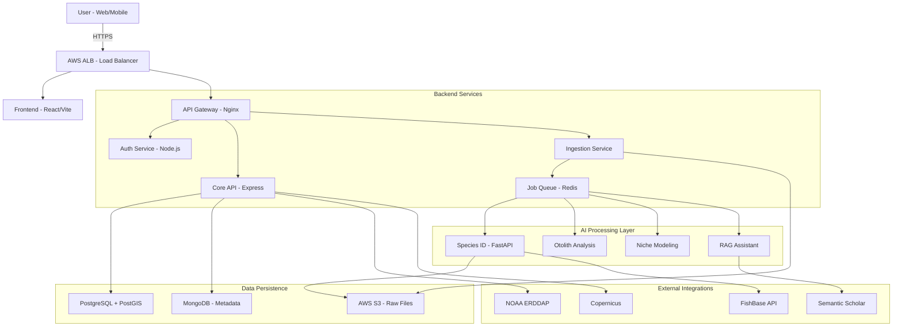

# System Design Document (SDD) - Merlin Platform

## 1. Executive Summary
This document outlines the architectural design and technical specifications for the **Merlin Platform**. The system is designed as a cloud-native, microservices-based application deployed on AWS, prioritizing scalability, modularity, and high availability. The architecture leverages modern technologies including React, Node.js, Python (FastAPI), PostgreSQL (PostGIS), and Docker.

---

## 2. System Architecture

### 2.1 Architectural Pattern
Merlin follows a **Microservices Architecture** with an Event-Driven design for asynchronous processing (e.g., file ingestion, AI inference). The system is composed of loosely coupled services communicating via REST APIs and a message queue (Redis/RabbitMQ).

### 2.2 High-Level Diagram


---

## 3. Component Design

### 3.1 Frontend (Presentation Layer)
-   **Tech Stack**: React 18, TypeScript, Vite, TailwindCSS.
-   **State Management**: Zustand for global state (User, Theme), React Query for server state.
-   **Visualization**:
    -   **Map Engine**: Leaflet (Base maps) + Deck.GL (High-performance WebGL overlays for 4D data).
    -   **Charts**: Recharts (Statistical data), D3.js (Complex interactive visualizations).
-   **Design System**: Atomic design principles with reusable components (Buttons, Cards, Modals).

### 3.2 Backend (Application Layer)
-   **Tech Stack**: Node.js, Express, TypeScript.
-   **Core Modules**:
    -   **User Management**: Registration, Login, Profile.
    -   **Data Catalog**: CRUD operations for datasets.
    -   **Job Orchestrator**: Manages asynchronous tasks (uploads, AI jobs).
-   **API Design**: RESTful principles with OpenAPI (Swagger) documentation.

### 3.3 AI Services (Intelligence Layer)
-   **Tech Stack**: Python 3.10, FastAPI, PyTorch/TensorFlow.
-   **Models**:
    -   **EfficientNet-B0**: Fine-tuned for Indian Ocean fish species classification.
    -   **Mask R-CNN**: For otolith segmentation and ring detection.
    -   **MaxEnt**: Java-based implementation wrapped in Python for Niche Modeling.
    -   **LangChain**: Orchestrates RAG pipeline with vector database (FAISS/Chroma).

### 3.4 Data Layer
-   **Relational Store (PostgreSQL 15)**:
    -   Users, Roles, Permissions.
    -   **PostGIS Extension**: Storing species occurrence points (Geometry/Geography types).
-   **Document Store (MongoDB 6)**:
    -   Flexible metadata schemas for diverse file types (JSON, GeoJSON, Metadata).
    -   Logs and Audit Trails.
-   **Object Store (AWS S3)**:
    -   Storage for raw uploaded files (Images, PDFs, Sequencing data).
    -   Hierarchical bucket structure: `merlin-data/{institute_id}/{project_id}/{file_type}/`.
-   **Cache (Redis)**:
    -   Session management.
    -   API response caching (e.g., frequent NOAA requests).
    -   Job queue for background workers.

---

## 4. Database Schema Design (Key Entities)

### 4.1 Users (PostgreSQL)
```sql
CREATE TABLE users (
    id UUID PRIMARY KEY DEFAULT uuid_generate_v4(),
    email VARCHAR(255) UNIQUE NOT NULL,
    password_hash VARCHAR(255) NOT NULL,
    role VARCHAR(50) CHECK (role IN ('admin', 'researcher', 'viewer')),
    institute_id UUID REFERENCES institutes(id),
    created_at TIMESTAMP WITH TIME ZONE DEFAULT NOW()
);
```

### 4.2 Occurrences (PostGIS)
```sql
CREATE TABLE occurrences (
    id UUID PRIMARY KEY,
    scientific_name VARCHAR(255) NOT NULL,
    aphia_id INT, -- WoRMS ID
    observation_date TIMESTAMP,
    depth DECIMAL(10, 2),
    location GEOGRAPHY(POINT, 4326), -- Spatial Index
    metadata JSONB -- Flexible Darwin Core fields
);
```

### 4.3 Datasets (MongoDB)
```json
{
  "_id": "ObjectId",
  "title": "Arabian Sea Cruise 2024",
  "type": "cruise_report",
  "files": [
    {
      "file_url": "s3://...",
      "file_type": "application/pdf",
      "ai_tags": ["tuna", "temperature", "kerala_coast"]
    }
  ],
  "compliance_score": 92,
  "validation_report": { ... }
}
```

---

## 5. Interface Design (UI/UX)

### 5.1 Design Philosophy
-   **"Ocean First" Aesthetic**: Deep blues, teals, and white space to evoke a marine environment.
-   **Glassmorphism**: Translucent panels for floating controls over the map.
-   **Accessibility**: WCAG 2.1 AA compliance (Color contrast, Keyboard navigation).

### 5.2 Key Workflows
1.  **Ingestion Wizard**: 
    -   Step 1: Drag & Drop Files.
    -   Step 2: Review AI-detected Metadata.
    -   Step 3: Resolve Validation Errors.
    -   Step 4: Confirm & Publish.
2.  **Analysis Dashboard**:
    -   Split-screen view: Map (Left 60%), Analytics Panel (Right 40%).
    -   Collapsible sidebar for layer control.

---

## 6. Security Design

### 6.1 Authentication & Authorization
-   **JWT (JSON Web Tokens)**: Stateless authentication.
-   **RBAC (Role-Based Access Control)**: Middleware checks permissions for every API route.
-   **MFA (Multi-Factor Authentication)**: Optional for Admin accounts.

### 6.2 Data Protection
-   **Encryption at Rest**: AWS EBS encryption for Databases, SSE-S3 for Object Storage.
-   **Encryption in Transit**: TLS 1.2+ for all client-server communication.
-   **Sanitization**: Input validation (Zod/Joi) to prevent SQL Injection and XSS.

---

## 7. Deployment Strategy (AWS)

### 7.1 Infrastructure as Code (IaC)
-   Terraform scripts to provision VPC, Subnets, EC2, RDS, and S3 resources.

### 7.2 CI/CD Pipeline
-   **GitHub Actions**:
    -   **Build**: Runs unit tests, builds Docker images.
    -   **Push**: Pushes images to AWS ECR (Elastic Container Registry).
    -   **Deploy**: Updates ECS Services with new image versions.

### 7.3 Scalability
-   **Frontend**: S3 Static Website Hosting + CloudFront CDN globally distributed.
-   **Backend**: AWS ECS (Fargate) with Auto Scaling based on CPU/Memory usage.
-   **Database**: Amazon RDS for PostgreSQL with Read Replicas for high read throughput.

---

## 8. Requirements Traceability

| Requirement ID | Design Component | Implementation |
| :--- | :--- | :--- |
| **FR-DI-01** (Multi-Format) | Ingestion Service | Python libraries (Pandas, PyPDF2, BioPython) |
| **FR-MV-01** (4D GIS) | Frontend | Deck.GL with TimeFilter extension |
| **FR-AI-01** (Species ID) | AI Worker | PyTorch EfficientNet model container |
| **FR-GT-03** (Provenance) | Backend/DB | SHA-256 hashing of job parameters stored in MongoDB |

---
